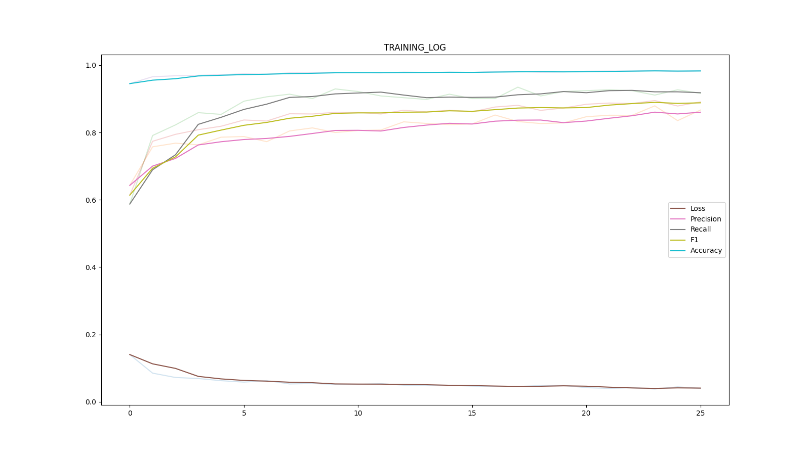
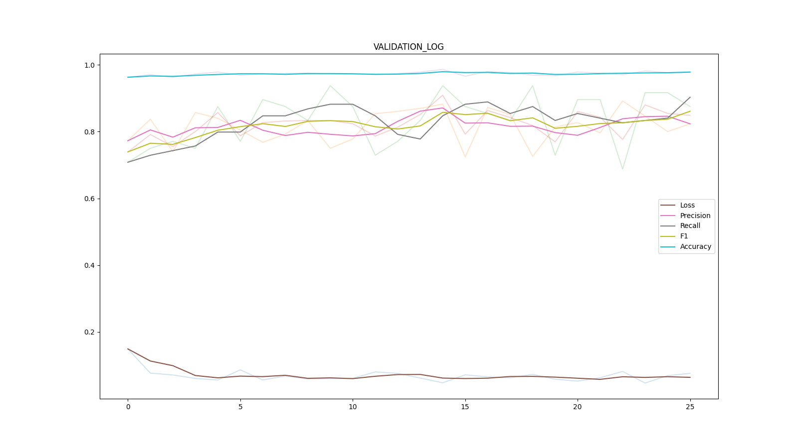

### Healthy, Phnumonia, and Covid-19 classifcation of V7 Labs & CloudFactory Release Annotated X-Ray Dataset
- Link: https://github.com/v7labs/covid-19-xray-dataset
- Blog: https://blog.cloudfactory.com/annotated-chest-x-ray-dataset-for-covid-19-research

I used the notebook NB.ipynb to transform the ground truth to work for my setting.

#### It consisted of ~6000 images with labels when I did this project: **Healthy, Phneumonia, and Covid** In this work I have applied two classification strategies using popular U-Net architecture.
### 1. Multi-label classification:
In this setting the labesl will be [h, p, c] where each value will be either 0 or 1.
for example, if any image is healthy the label would be [1, 0, 0]. If any image has only Phnumonia it will be [0, 1, 0]
In most cases if there is covid present, there will also be Pnuemonia.

### 2. Binary Classification
- In this setting, we treat each image as either image with no-covid (label 0), or with covid(label 1) and do binary classification.
### How to run?
- Downlad datasets.zip from releases. Extract in the project directory (inside covidxfactory, so it should be covidxfactory/datasets/...)
- Install pytorch and torchvision from official website
- pip install easytorch
```commandline
python main.py -ph test -b 32 -wm multi -nw 16 -e 71 -nch 1 -pat 11
python main.py -ph train -b 32 -wm binary -nw 16 -e 71 -nch 1 -pat 11
```
### 10-fold cross validation results for multi-label classification:
|SPLIT       |Precision|Recall|F1    |Accuracy|
|------------|---------|------|------|--------|
|SPLIT_0.json|0.7627   |0.8333|0.7964|0.9644  |
|SPLIT_5.json|0.8654   |0.9783|0.9184|0.9876  |
|SPLIT_8.json|0.8605   |0.7708|0.8132|0.9737  |
|SPLIT_4.json|0.7544   |0.9556|0.8432|0.9752  |
|SPLIT_3.json|0.7551   |0.9024|0.8222|0.9752  |
|SPLIT_1.json|0.7903   |0.9074|0.8448|0.9721  |
|SPLIT_9.json|0.86     |0.86  |0.86  |0.9783  |
|SPLIT_6.json|0.7458   |0.9167|0.8225|0.9706  |
|SPLIT_2.json|0.7719   |0.9778|0.8627|0.9783  |
|SPLIT_7.json|0.8113   |0.86  |0.8349|0.9737  |
|Global      |0.7948   |0.894 |0.8415|0.9749  |

### 10-fold cross validation results for binary classification:
|SPLIT       |Precision|Recall|F1    |Accuracy|
|------------|---------|------|------|--------|
|SSPLIT_0.json|0.7963   |0.7963|0.7963|0.9659  |
|SPLIT_5.json|0.8627   |0.9565|0.9072|0.9861  |
|SPLIT_8.json|0.8039   |0.8542|0.8283|0.9737  |
|SPLIT_4.json|0.7586   |0.9778|0.8544|0.9768  |
|SPLIT_3.json|0.8293   |0.8293|0.8293|0.9783  |
|SPLIT_1.json|0.8182   |0.8333|0.8257|0.9706  |
|SPLIT_9.json|0.746    |0.94  |0.8318|0.9705  |
|SPLIT_6.json|0.7778   |0.875 |0.8235|0.9721  |
|SPLIT_2.json|0.8222   |0.8222|0.8222|0.9752  |
|SPLIT_7.json|0.8214   |0.92  |0.8679|0.9783  |
|Global      |0.8011   |0.8794|0.8384|0.9748  |

Training:

Validation:


### References for U-NET
``
Architecture used, O. Ronneberger, P. Fischer, and T. Brox, “U-net: Convolutional networks for biomedical image segmentation,” in MICCAI, (2015)
``